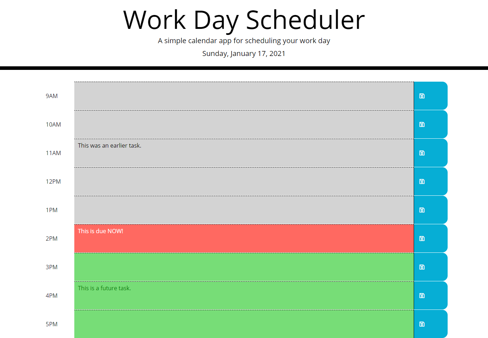

# Work Day Scheduler

## Description
A simple task scheduling application that allows a user to save events for each hour of the work day. Once saved by clicking the blue button, tasks are saved to localStorage for retrieval the next time the application is loaded.

## Screenshot

## Deployed at:

https://bluesatyr.github.io/work-day-scheduler/